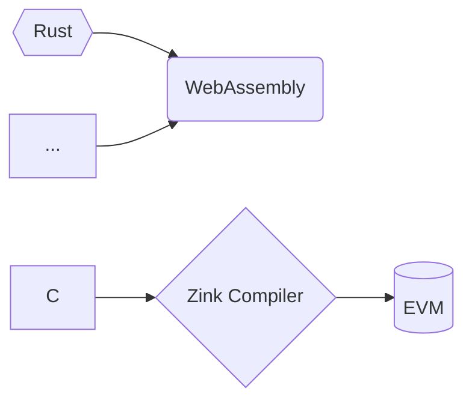

## zink

[![zink][version-badge]][version-link]
[![ci][ci-badge]][ci-link]
[![telegram][telegram-badge]][telegram-group]

Zink programming language that targets the Ethereum Virtual Machine.

Zink is designed for building zero-knowledge proofs for EVM contracts elegantly and efficiently, with 
the support of zink, you can write your Ethereum contract in any language that could be compiled into
WebAssembly!



## Installation

```shell
cargo install zinkc
zinkc --help
Command line interface for the zink compiler

Usage: zinkc [OPTIONS] <INPUT>

Arguments:
  <INPUT>  The path to the wasm file or the rust project directory. ( only support cargo project as input for now )

Options:
  -o, --output <filename>  Write output to <filename>
      --out-dir <dir>      Write output to compiler-chosen filename in <dir>
      --release            Optimize with default optimizations
  -v, --verbose...         Verbose mode (-v, -vv, -vvv, etc.)
  -h, --help               Print help (see more with '--help')
  -V, --version            Print version
```

## Example

We can start an empty project with <kbd>cargo new</kbd>, for example, we just created a new
project named `addition` (see `examples/addition`), and this is the `lib.rs` of our project.

```rust
//! Addition example.
#![cfg_attr(target_arch = "wasm32", no_std)]

// for panic handler.
#[cfg(all(target_arch = "wasm32", not(test)))]
extern crate zink;

/// Adds two numbers together.
#[no_mangle]
pub extern "C" fn add(x: u64, y: u64) -> u64 {
    x + y
}
```

Now, let's run zinkc to compile this project into evm bytecode (TODO)

```shell
cd addition
zinkc . --out-dir bin
ls bin
addition.wasm addition.bin
```

## LICENSE

GPL-3.0-only

[telegram-badge]: https://img.shields.io/badge/telegram-blue?logo=telegram 
[telegram-group]: https://t.me/+6oZpbwxlVD81OGQ1
[version-badge]: https://img.shields.io/crates/v/zink
[version-link]: https://docs.rs/zink/latest/zink/
[ci-badge]: https://img.shields.io/github/actions/workflow/status/clearloop/zink/CI.yml
[ci-link]: https://github.com/clearloop/zink/actions/workflows/CI.yml
