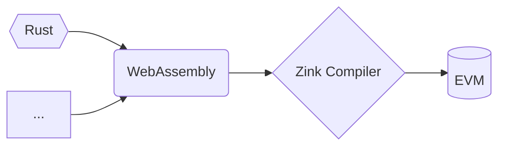

# Zink

> **Warning**
>
> This project is still under active development, plz DO NOT use it in production.

[![zink][version-badge]][version-link]
[![ci][ci-badge]][ci-link]
[![telegram][telegram-badge]][telegram-group]

[The Zink project][book] mainly provides a singlepass compiler `zinkc` which compiles
WASM to EVM bytecode, the source code of your smart contract could be any language you
like!



Here we highly recommand you to choose `rust` as the language of your smart contracts
which will unlock all of the following features:

- **Safe**: `rustc` is wathcing you! Furthermore, after compiling your rust code to WASM,
  `zinkc` will precompute all of the stack and memory usages in your contracts to ensure they
  are safe in EVM bytecode as well!

- **High Performance**: The optimizations are provided by the three of `rustc`, `wasm-opt`
  and `zinkc`, your contracts will have the smallest size with **strong performance** in EVM
  bytecode at the end!

- **Compatible**: All of the `no_std` libraries in rust are your libraries, you can use your 
  solidity contracts as part of your zink contracts and your zink contracts as part of your 
  solidty contracts :)

- **Easy Debugging**: Developing your smart contracts with only one programming language!
  zink will provide everything you need for developing your contracts officially based on the
  stable projects in rust like the `foundry` tools.

Run `cargo install zinkup` to install the toolchain!

## Fibonacci Example

| fib(n) | Zink | Solidity@0.8.21 |
| ------ | ---- | --------------- |
| 0      | 110  | 614             |
| 1      | 110  | 614             |
| 2      | 262  | 1322            |
| 3      | 414  | 2030            |
| 4      | 718  | 3446            |
| 5      | 1174 | 5570            |

```rust
/// Calculates the nth fibonacci number using recursion.
#[no_mangle]
pub extern "C" fn recursion(n: usize) -> usize {
    if n < 2 {
        n
    } else {
        recursion(n - 1) + recursion(n - 2)
    }
}
```

As an example for the benchmark, calculating fibonacci sequence with recursion, missed
vyper because it doesn't support recursion...Zink is 5x fast on this, but it is mainly
caused by our current implementation is not completed yet ( missing logic to adapt more
situations ), let's keep tuned for `v0.3.0`.

## LICENSE

GPL-3.0-only

[book]: https://docs.zink-lang.org/
[telegram-badge]: https://img.shields.io/badge/telegram-blue?logo=telegram
[telegram-group]: https://t.me/+6oZpbwxlVD81OGQ1
[version-badge]: https://img.shields.io/crates/v/zink
[version-link]: https://docs.rs/zinkc
[ci-badge]: https://img.shields.io/github/actions/workflow/status/clearloop/zink/main.yml
[ci-link]: https://github.com/clearloop/zink/actions/workflows/main.yml
[rustc-codegen]: https://doc.rust-lang.org/rustc/codegen-options/index.html
[wasm-opt]: https://github.com/WebAssembly/binaryen#binaryen-optimizations
