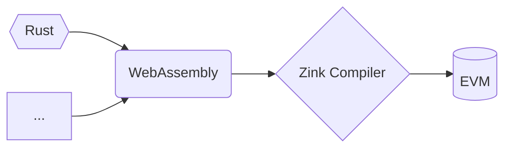

# Zink 

> This project is under development, plz DO NOT use it in production.

[![zink][version-badge]][version-link]
[![ci][ci-badge]][ci-link]
[![telegram][telegram-badge]][telegram-group] 

The Zink project mainly provides an optimizing compiler `zinkc` which can compile WASM 
to the EVM bytecode with optimizations, the source code of your smart contract could be 
any language you like! 



Here we highly recommand you to choose `rust` as the language of your smart contracts 
which will unlock all of the following features:

- **Safe**: `rustc` is wathcing you! After compiling your rust code into WASM, `zinkc` 
will precompute all of the stack and memory usages in your contracts to ensure try are
safe in EVM bytecode as well!

- **High Performance**: The optimizations are provided by the three of `rustc`, `wasm-opt` 
and `zinkc`, your contracts will have the smallest size with **strong performance** in EVM 
bytecode at the end! More details plz check [Optimizations](./docs/optimizations.md).

- **Compatible**: All of the `no_std` libraries in rust are your libraries, futhermore, you 
can use your solidity contracts as part of your zink contracts and your zink contracts as 
part of your solidty contracts :)

- **Easy Debugging**: Developing your smart contracts with only one programming language! 
zink will provide everything you need for developing your contracts officially based on the 
stable projects in rust like the `foundry` tools.


## Installation

> Zink tools are still under development, the following examples
> will be updated frequently before `v0.1.0`.

```shell
cargo install zinkup
elko --help
Package manager of zink project

Usage: elko [OPTIONS] <INPUT>

Arguments:
  <INPUT>  The path to the wasm file or the rust project directory. ( only support cargo project as input for now )

Options:
  -o, --output <filename>  Write output to <filename>
      --out-dir <dir>      Write output to compiler-chosen filename in <dir>
      --release            Optimize with default optimizations
  -v, --verbose...         Verbose mode (-v, -vv, -vvv, etc.)
  -h, --help               Print help (see more with '--help')
  -V, --version            Print version
```

## Example

We can start an empty project with <kbd>cargo new</kbd>, for example, we just created a new
project named `addition` (see `examples/addition`), and this is the `lib.rs` of our project.

```rust
//! Addition example.
#![cfg_attr(target_arch = "wasm32", no_std)]

// for panic handler.
#[cfg(all(target_arch = "wasm32", not(test)))]
extern crate zink;

/// Adds two numbers together.
#[no_mangle]
pub extern "C" fn add(x: u64, y: u64) -> u64 {
    x + y
}
```

Now, let's run zinkc to compile this project into evm bytecode (TODO)

```shell
cd addition
zinkc . --out-dir bin
ls bin
addition.wasm addition.bin
```

## LICENSE

GPL-3.0-only

[telegram-badge]: https://img.shields.io/badge/telegram-blue?logo=telegram 
[telegram-group]: https://t.me/+6oZpbwxlVD81OGQ1
[version-badge]: https://img.shields.io/crates/v/zink
[version-link]: https://docs.rs/zink/latest/zink/
[ci-badge]: https://img.shields.io/github/actions/workflow/status/clearloop/zink/CI.yml
[ci-link]: https://github.com/clearloop/zink/actions/workflows/CI.yml
[rustc-codegen]: https://doc.rust-lang.org/rustc/codegen-options/index.html
[wasm-opt]: https://github.com/WebAssembly/binaryen#binaryen-optimizations
