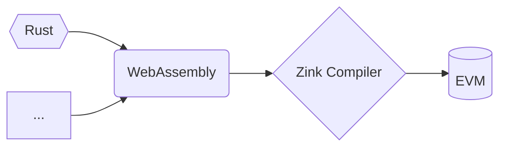

## zink

[![zink][version-badge]][version-link]
[![ci][ci-badge]][ci-link]
[![telegram][telegram-badge]][telegram-group]

Yet another programming language that targets the Ethereum Virtual Machine, yes, 
WebAssemly Gonna Make It! 

Zink is not a programming language in strict, The naming of `Zink` means `zinc`, `ink`, 
`zk`, `link`, it mainly provides an optimizing compiler `zinkc` which can compile WASM 
into the EVM bytecode, with `zinkc`, the source code of your smart contract could be any 
language you like! 

Here we highly recommand you to choose `rust` as the language of your smart contracts which 
will unlock all of the following features:

- **Safe**: `rustc` is wathcing you! before compling your contracts 
into WASM, `rustc` and the debugging tools ( for example clippy ) in rust will check 
your logic first,  which will be the first process auditing your smart contracts!

- **Small Size**: Benifits from the development of WASM, there is a lot of tools which
have already in production can reduce the size of your WASM files with optimizations.

- **High Performance**: `zinkc` is an optimizing compiler that not only translate WASM into 
EVM bytecode but with optimizations, stack and memory will be checkd at the compilation time, 
variables, control flow...everything will be optmized as well if it is safe and possible, 
furthermore, `zinkc` can optimize the arithmetic operations in your contracts with tail 
recursion as well!

- **Gas Optimizations**: After `rustc`, `wasm-opt` and the custom optimizations in `zinkc`, 
`zinkc` will provide complation flags for diving it deeper just like other smart contract 
languages, all of the gas optimization flags in solidity and vyper will be supported in
`zinkc` as well!

- **Debugging**: No more need more than two programming langauges for developing your smart 
contracts, except the native debugging tools of the rust ecosystem, zink will provide everything
you need for developing your contracts officially based on the stable projects in rust like
`foundry` tools. Also, it is easy to develop code analysing tools for your zink contracts based 
on the libraries provided by the rust and wasm ecosystems.

- **Extensible**: You can use all of the libraries in rust that supports `no_std` features!
If you'd like to introduce zero-knowledge proof features for your contracts, just import
them without any other overkilling steps!

- **Compatible**: You can use your solidity contracts as part of your zink contracts and 
your zink contracts as part of your solidty contracts :)

- **Smart**: Write once, run anywhere! Since we have WASM as our middle language, Zink
will support the interfaces of the smart contract platforms that running WASM contracts by 
default! What if the target platform doesn't support WASM? Zink has its own IR for compling 
WASM into different platforms' bytecode as well!




## Installation

> Zink tools are still under development, the following examples
> will be updated frequently before `v0.1.0`.

```shell
cargo install zinkup
elko --help
Package manager of zink project

Usage: elko [OPTIONS] <INPUT>

Arguments:
  <INPUT>  The path to the wasm file or the rust project directory. ( only support cargo project as input for now )

Options:
  -o, --output <filename>  Write output to <filename>
      --out-dir <dir>      Write output to compiler-chosen filename in <dir>
      --release            Optimize with default optimizations
  -v, --verbose...         Verbose mode (-v, -vv, -vvv, etc.)
  -h, --help               Print help (see more with '--help')
  -V, --version            Print version
```

## Example

We can start an empty project with <kbd>cargo new</kbd>, for example, we just created a new
project named `addition` (see `examples/addition`), and this is the `lib.rs` of our project.

```rust
//! Addition example.
#![cfg_attr(target_arch = "wasm32", no_std)]

// for panic handler.
#[cfg(all(target_arch = "wasm32", not(test)))]
extern crate zink;

/// Adds two numbers together.
#[no_mangle]
pub extern "C" fn add(x: u64, y: u64) -> u64 {
    x + y
}
```

Now, let's run zinkc to compile this project into evm bytecode (TODO)

```shell
cd addition
zinkc . --out-dir bin
ls bin
addition.wasm addition.bin
```

## LICENSE

GPL-3.0-only

[telegram-badge]: https://img.shields.io/badge/telegram-blue?logo=telegram 
[telegram-group]: https://t.me/+6oZpbwxlVD81OGQ1
[version-badge]: https://img.shields.io/crates/v/zink
[version-link]: https://docs.rs/zink/latest/zink/
[ci-badge]: https://img.shields.io/github/actions/workflow/status/clearloop/zink/CI.yml
[ci-link]: https://github.com/clearloop/zink/actions/workflows/CI.yml
