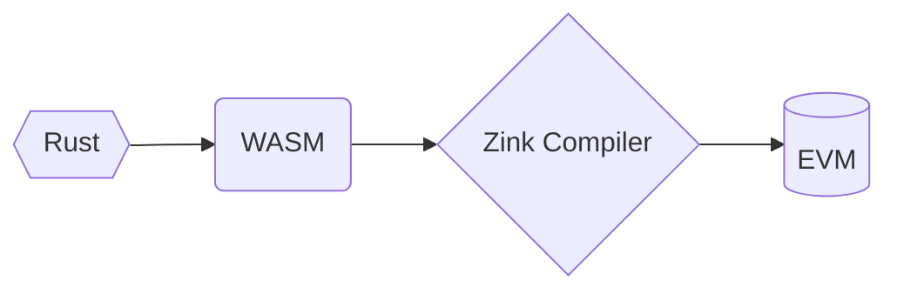

# The Zink Language

> [!CAUTION]
>
> This project is still under active development, please DO NOT use it in production.

[![zink][version-badge]][version-link]
[![ci][ci-badge]][ci-link]
[![telegram][telegram-badge]][telegram-group]

Rustic smart contract language that targets the EVM.



- **Safe**: `rustc` monitors your code! After compiling to WASM, `zinkc` precomputes stack
  and memory usage to ensure safety in EVM bytecode.

- **High Performance**: Optimizations from `rustc`, `wasm-opt`, and `zinkc` yield small,
  high-performance EVM bytecode.

- **Modular**: Upload and download your contract components via `crates.io`.

- **Easy Debugging**: Develop smart contracts just in rust! All of the rust tools are available for your contracts!

Run `cargo install zinkup` to install the toolchain!

## ERC20 Example (In Development)

```rust
#[zink::contract]
pub struct ERC20;

#[zink::calls]
impl ERC20 {
  /// VMs that zink supports
  pub fn support() -> [zink::String; 4] {
    ["EVM", "WASM", "RISC-V", "...OTHER_VMS"]
  }
}

#[zink::interface]
impl ERC20 for ERC20 {
  fn name() -> zink::String {
    "Zink Language".to_string()
  }
}
```

## Special Thanks

- [MegaETH](https://github.com/MegaETH) for the funding and trust!
- [revm](https://github.com/bluealloy/revm) for the EVM in rust!

## LICENSE

GPL-3.0-only

[book]: https://zink-lang.org/
[telegram-badge]: https://img.shields.io/endpoint?label=chat&style=flat&url=https%3A%2F%2Fmogyo.ro%2Fquart-apis%2Ftgmembercount%3Fchat_id%3Dzinklang
[telegram-group]: https://t.me/zinklang
[version-badge]: https://img.shields.io/crates/v/zinkc
[version-link]: https://docs.rs/zinkc
[ci-badge]: https://img.shields.io/github/actions/workflow/status/clearloop/zink/main.yml
[ci-link]: https://github.com/clearloop/zink/actions/workflows/main.yml
[rustc-codegen]: https://doc.rust-lang.org/rustc/codegen-options/index.html
[wasm-opt]: https://github.com/WebAssembly/binaryen#binaryen-optimizations
